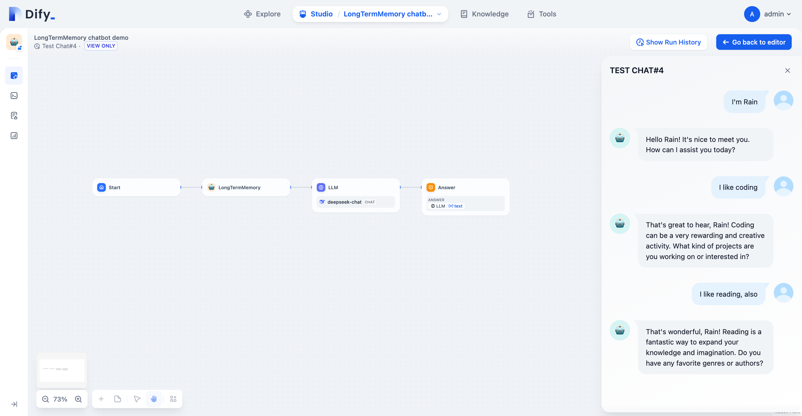

# About this repo

a Dify tool for storing and retrieving long-term-memory, using Dify built-in Knowledge dataset for storing memories, each user has a standalone long-term-memory space.


## Video

https://github.com/rainchen/dify-tool-LongTermMemory/assets/71397/8c4253ac-9dd7-44a7-94d7-583388ee69db


# Usage Steps

## step 1: create a Knowledge and document for storing long-term-memory

1)create a new Knowledge and import an empty document

- document name: whatever

- Chunk settings: Automatic


## step 2: Create a new Secret key for accessing Knowledge API


## step 3:  import the workflow DSL yaml

config  MODEL for `LLM:Parameter Extractor` node, which LLM performance must be >= gpt4


## step 4: publish the workflow as tool "LongTermMemory"


## step 5: create new a chatbot app using chatflow


## step 6: add the "LongTermMemory" tool 

add the "LongTermMemory" tool before LLM node


## step 7: config parameters for  "LongTermMemory" tool

notes for parameters:

- base_url: `http://host.docker.internal` for docker-compose deployment

- dataset_id: dataset id

- document_id:  document id

- api_key: Dify Knowledge API key)

- memory_template: for example

```
<UserInfo>
  <name>${user_name}</name>
  <age>${user_age}</age>
  <hobbies>${user_hobbies}</hobbies>
  <any_user_info>${any_user_info}</any_user_info>
</UserInfo>
```

- user_input: `{{#sys.query#}}`


## step 8: Config LLM node


CONTEXT：select `LongTermMemory` node's `text` 

SYSTEM prompt:

```
{{#context#}}
```


# Test:

### Scenario 1: test long-term-memory remembering



user input:

- > who am I?

  - chatbot should reply no idea

- > I'm Rain

  - check out the knowledge page, there should be a new segment with user_id, name, and keyword attribute tags

- > I like coding

  - check out  the knowledge page, the segment should be updated,  <hobbies> tag should be updated

- > I like reading, also

  - check out  the knowledge page, the segment should be updated,  <hobbies> tag should be updated

### Scenario 2: test long-term-memory retrieving


user input:

- what's my name?
  - chatbot should reply current user's name
- what do I like?
  - chatbot should reply current user's hobbies


### Scenario 3: each user has a standalone long-term-memory space


Run App

user input:

- I'm Jerry
- I like eating
  - check out the knowledge page, there should be a new segment with different user_id, name, and keyword attribute tags
