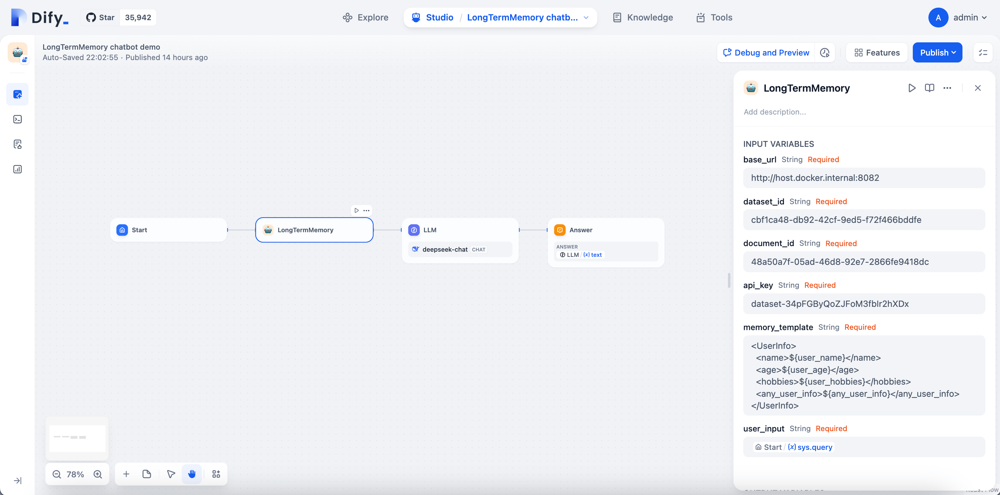

# About this repo

a Dify tool for storing and retrieving long-term-memory, using Dify built-in Knowledge dataset for storing memories, each user has a standalone long-term-memory space.
Make chatbot can persistently remember customized information per user.

workflow view:


# How it works

Here is the major logic of this workflow:

1. before each conversation run a "HTTP Request" node named "Action:retrieve_memory_of_user" to request Dify Knowledge API to query user related document segments with filter parameters as `keyword=$current_user_id`
2. run a "Template" node as "Agent prompt"([agent prompt content](agent-prompt.md)) for preparing agent system prompt, injected customized `$memory_template`

2. run a "Parameter Extractor" node to extract `$action`(value will be one of reply/add_user_memory/update_user_memory ) and `$longterm_memory_content` parameters
3. if the `$action` is not "reply",  run a "HTTP Request" node to request Dify Knowledge API to create or update the document segment with `$longterm_memory_content` parameter
4. if the `$action` is "reply", return the retrieved segments as a output variable `$longterm_memory_space`, so that it can be injected as a LLM node's context in a chatbot


# Demo Video

https://github.com/user-attachments/assets/a61c065f-5e74-4ea3-95ab-5badc87bc9a1


# Usage Steps

## step 1: create a Knowledge and document for storing long-term-memory

create a new Knowledge and import an empty document

- document name: whatever

- Chunk settings: Automatic

- Index mode: Economical

## step 2: Create a new Secret key for accessing Knowledge API


## step 3:  import the workflow DSL yaml

1) download [LongTermMemory.yml](https://raw.githubusercontent.com/rainchen/dify-tool-LongTermMemory/main/LongTermMemory.yml) file and import it using Dify "Import DSL file"

2) In the imported workflow, config MODEL for `LLM:Parameter Extractor` node, which LLM performance must be >= gpt4.
Tips: gpt4 series, deepseek-chat are recommended, gpt3.5-turbo was tested but not powerful enough to run this tool.


## step 4: publish the workflow as tool "LongTermMemory"


## step 5: create new a chatbot app using chatflow


## step 6: add the "LongTermMemory" tool 

add the "LongTermMemory" tool before LLM node


## step 7: config parameters for "LongTermMemory" tool



notes for parameters:

- base_url: `http://host.docker.internal` for docker-compose deployment on MacOS(use `http://docker.for.win.localhost` for Windows 10/11), append the port like `:8082` if not using default nginx port config

- dataset_id: dataset id

- document_id:  document id

- api_key: Dify Knowledge API key, this is not "Chat App API key". You can get one on 'Knowledge -> API ACCESS' page, a Knowledge API key should be look like "dataset-xxx"

- memory_template: for example

```
<UserInfo>
  <name>${user_name}</name>
  <age>${user_age}</age>
  <hobbies>${user_hobbies}</hobbies>
  <any_user_info>${any_user_info}</any_user_info>
</UserInfo>
```

- user_input: `{{#sys.query#}}`


## step 8: Config LLM node


CONTEXT：select `LongTermMemory` node's `text` 

SYSTEM prompt:

```
{{#context#}}
```


# Test:

### Scenario 1: test long-term-memory remembering


user input:

- > who am I?

  - chatbot should reply no idea

- > I'm Rain

  - check out the knowledge page, there should be a new segment with user_id, name, and keyword attribute tags

- > I like coding

  - check out  the knowledge page, the segment should be updated,  <hobbies> tag should be updated

- > I like reading, also

  - check out  the knowledge page, the segment should be updated,  <hobbies> tag should be updated

### Scenario 2: test long-term-memory retrieving


Debug and Preview -> Restart (make sure to start a new conversion without chat history)

user input:

- what's my name?
  - chatbot should reply current user's name
- what do I like?
  - chatbot should reply current user's hobbies


### Scenario 3: each user has a standalone long-term-memory space


Run App (You can use different browsers to access and impersonate different users)

user input:

- I'm Jerry
- I like eating
  - check out the knowledge page, there should be a new segment with different user_id, name, and keyword attribute tags
